# GNN-Grandmaster

## Installation

You need `conda` (or `mamba`) to be installed. Then to set up the `gnn-gm` environment :

```shell
conda env create -f environment.yml
conda activate gnn-gm
```

If `environment.yml` file is modified, just run the following command to update it:

```shell
conda activate gnn-gm
conda env update --file environment.yml --prune
```
You can also use pip with the `requirements.txt` file.

## Generating Dataset

To generate the dataset, download the Lichess database of **evaluation**
(See [HERE](https://database.lichess.org/#evals)). Next, extract the file in a directory.
Then generate the dataset with:

```shell
conda activate gnn-gm
preprocess.py [--chunk-size CHUNK_SIZE] --size SIZE [--process PROCESS] LICHESS_FILE OUTPUT_DIRECTORY
```
You will need ~8Go of free space for a dataset of 1,000,000 entries.

### Arguments:
- `LICHESS_FILE`: Path to the Lichess JSONL file.
- `OUTPUT_DIRECTORY`: Path to the directory where processed files will be stored.
- `--size SIZE`: Final length of the Dataset (Required).
- `--process PROCESS`: Number of processes used for reading the file (default: 2).

### Example

```bash
python preprocess.py lichess_data.jsonl output/ --size 500000 --process 2
```

### Output Structure

The script generates the following output structure:
```
output/
│-- nodes/
│   ├── xx/
│   │   ├── nodes_0.npy
│   │   ├── nodes_1.npy
│   │   ├── ...
│-- edges/
│   ├── xx/
│   │   ├── edges_0.npy
│   │   ├── edges_1.npy
│   │   ├── ...
│-- cp.npy
│-- dataset.json
```
- `nodes/` and `edges/` contain processed chess board states and move connections.
- `cp.npy` stores centipawn evaluation values.
- `dataset.json` contains metadata about the processed dataset.

## Training Models

To train the models, run the script from the command line with the following arguments:

```bash
python train_model.py (--gnn | --mlp) --dataset-size DATASET_SIZE --epochs EPOCHS --batch-size BATCH_SIZE --load-workers LOAD_WORKERS --model-save MODEL_SAVE DATASET_DIR
```
### Required Arguments:
- `--dataset-size DATASET_SIZE`: Number of data points to use for training.
- `--epochs EPOCHS`: Number of training epochs.
- `--batch-size BATCH_SIZE`: Batch size for training.
- `--load-workers LOAD_WORKERS`: Number of parallel data-loading workers.
- `--model-save MODEL_SAVE`: Directory to save the trained model and results.
- `DATASET_DIR`: Root directory containing the dataset generated by `preprocess.py`.

### Model Selection:
- `--gnn`: Train the Graph Neural Network (GNN) model.
- `--mlp`: Train the Multi-Layer Perceptron (MLP) model.

### Example

```bash
python train_model.py --gnn --dataset-size 1000000 --epochs 10 --batch-size 256 --load-workers 8 --model-save results/ dataset/
```

### Output Structure

The script generates the following output:
```
output/
│-- model.pth          # Trained model weights
│-- stats.npz          # Training statistics (loss, accuracy, precision, recall)
│-- params.json        # Training parameters used
│-- train_loss.png     # Training loss plot
│-- train.png          # Training metrics plot
│-- test_loss.png      # Test loss plot
│-- test.png           # Test metrics plot
│-- results.zip        # All output files in a zip archive
```

The `stats.npz` file contains training and test metrics recorded during the training process. It includes:
- `train_loss`: List of training loss values per epoch.
- `train_accuracy`: List of training accuracy values per epoch.
- `train_precision`: List of training precision values per epoch.
- `train_recall`: List of training recall values per epoch.
- `test_loss`: List of test loss values per epoch.
- `test_accuracy`: List of test accuracy values per epoch.
- `test_precision`: List of test precision values per epoch.
- `test_recall`: List of test recall values per epoch.

These arrays can be loaded in Python using:

```python
import numpy as np

stats = np.load('stats.npz')
print(stats['train_loss'])
```

## Results

This section provides a comparative analysis of training and evaluation metrics for MLP and GNN models across different dataset sizes (10k, 100k, and 1M positions). The plots illustrate accuracy and loss trends over 10 epochs. The data was split with a train-test ratio of 0.9. The baseline accuracy is derived from a naive model that estimates player performance based on the total value of their remaining chess pieces.


### 10k Dataset

| Metric | MLP (10k) | GNN (10k) |
|--------|----------|----------|
| **Training Accuracy** | 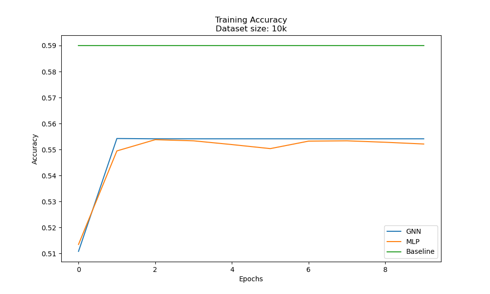 |  |
| **Training Loss** | 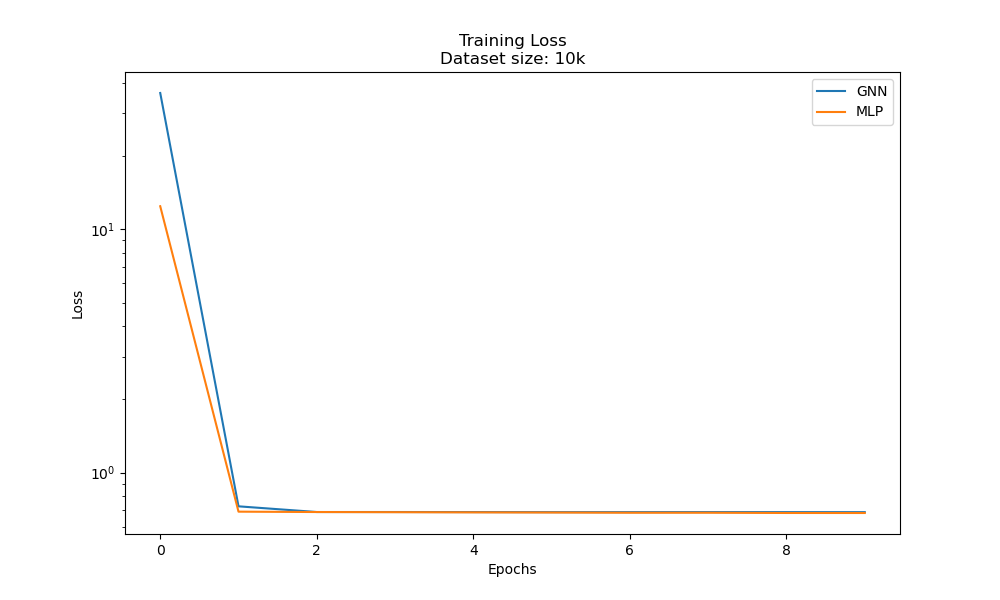 |  |
| **Test Accuracy** | 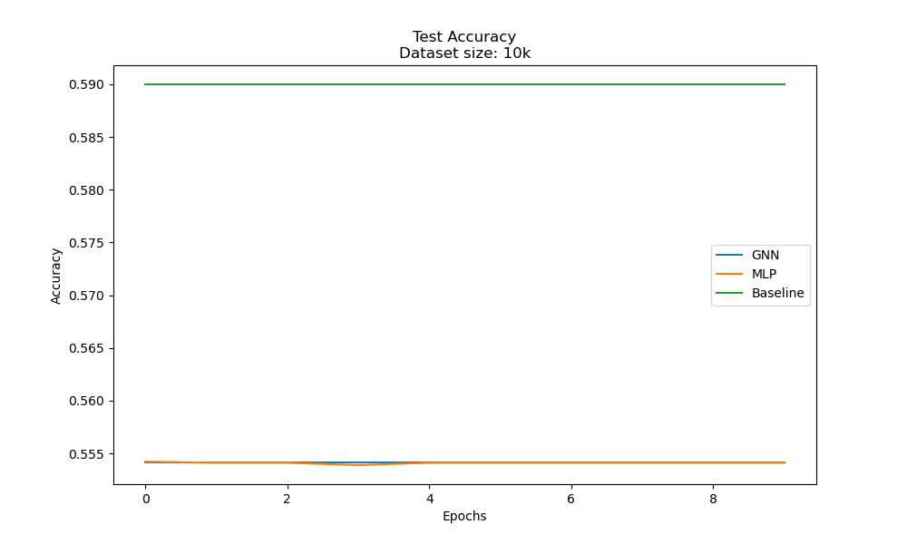 |  |
| **Test Loss** | 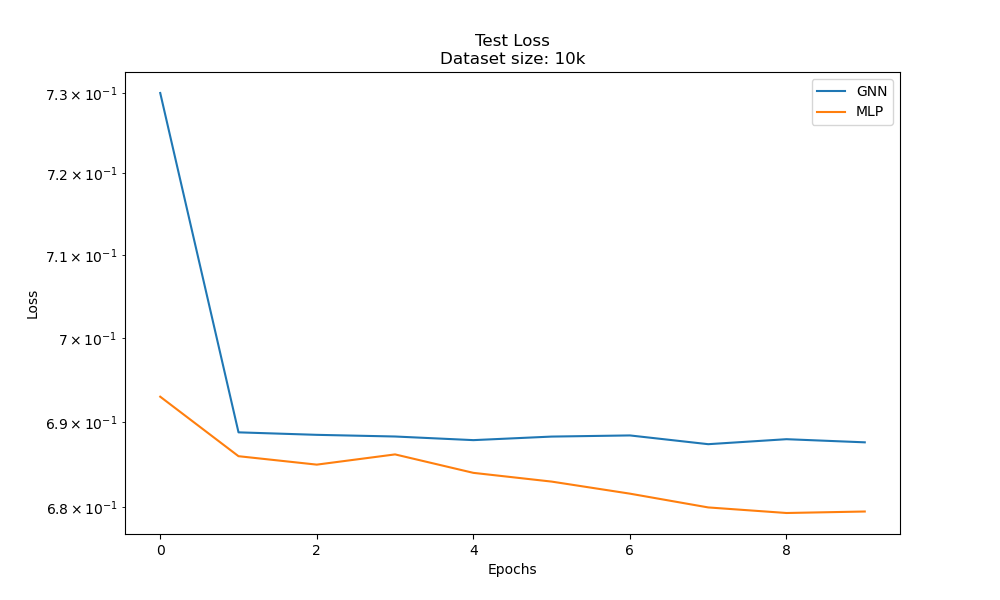 |  |

### 100k Dataset

| Metric | MLP (100k) | GNN (100k) |
|--------|-----------|-----------|
| **Training Accuracy** | 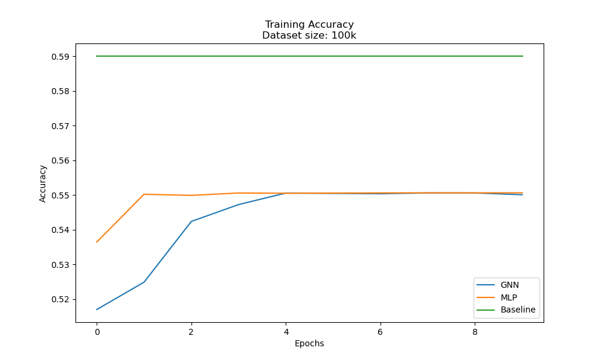 |  |
| **Training Loss** | 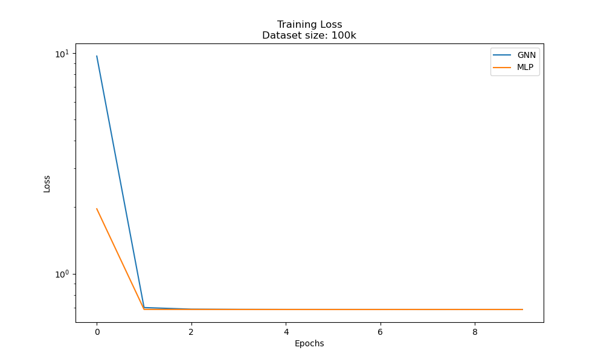 |  |
| **Test Accuracy** | 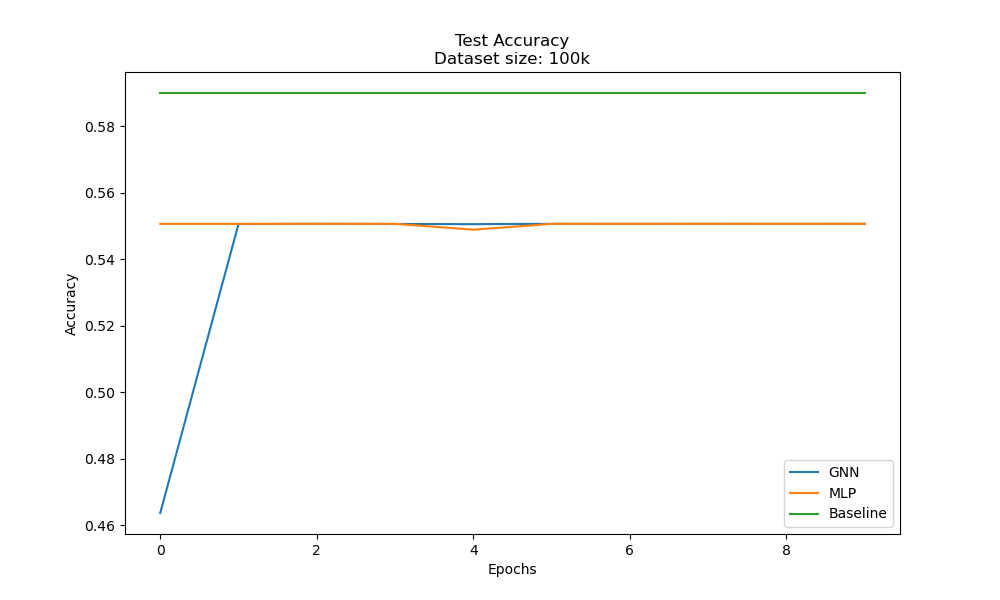 |  |
| **Test Loss** | 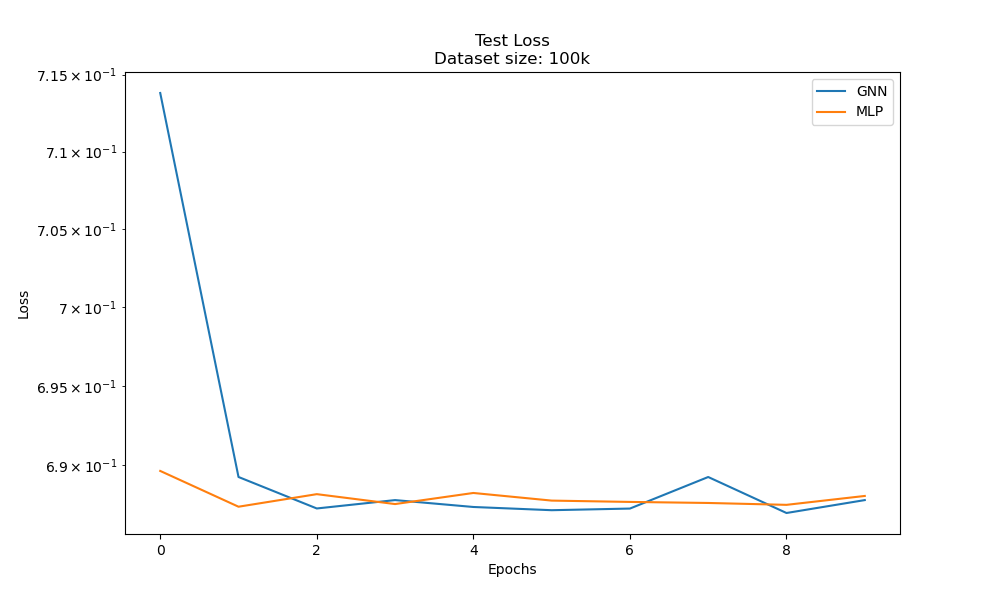 |  |

### 1M Dataset

| Metric | MLP (1M) | GNN (1M) |
|--------|---------|---------|
| **Training Accuracy** | 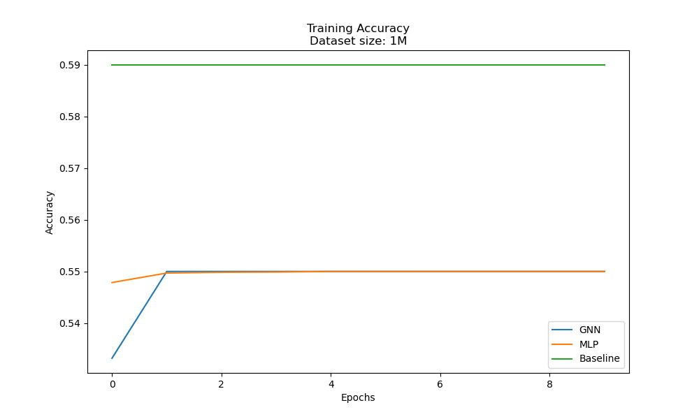 |  |
| **Training Loss** | 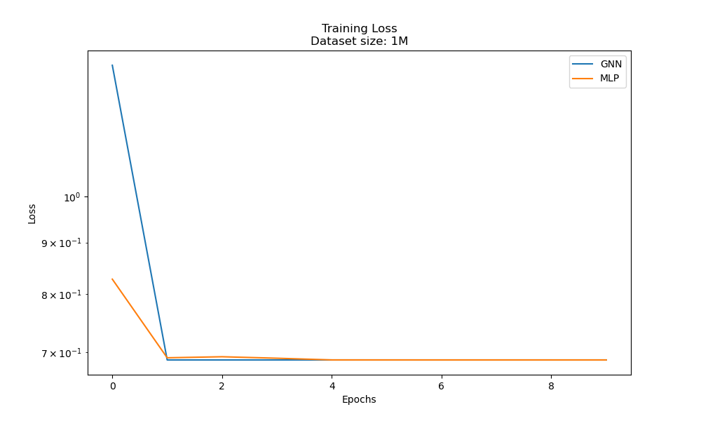 |  |
| **Test Accuracy** | 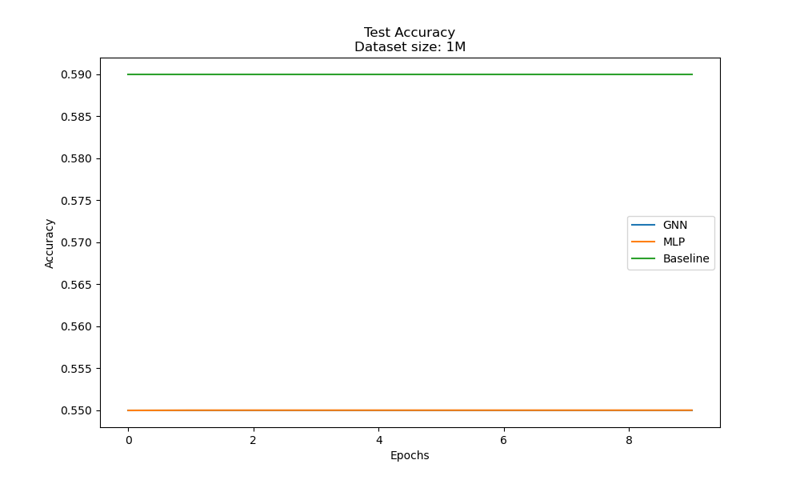 |  |
| **Test Loss** | 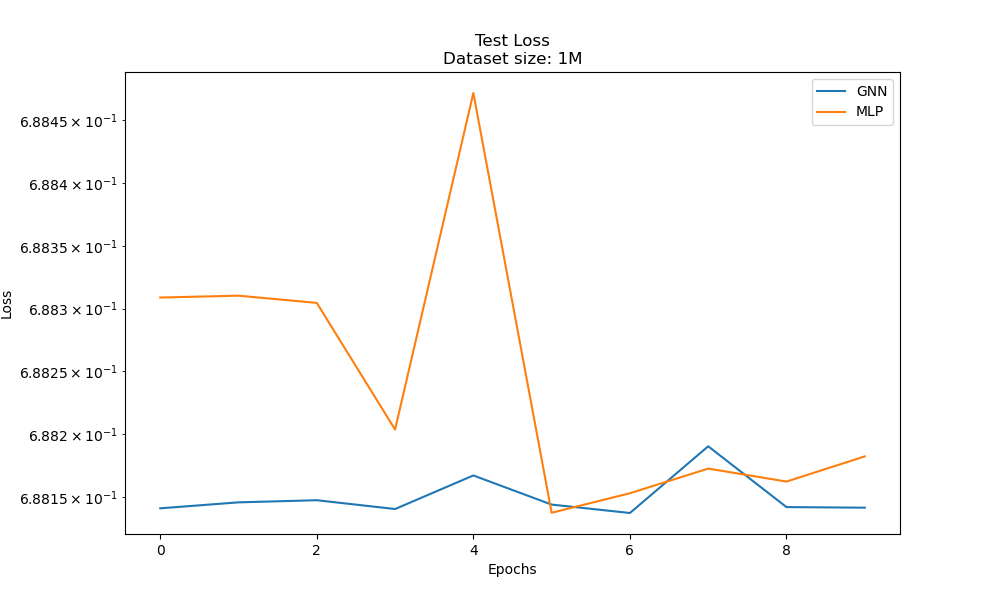 |  |

Each plot shows the performance of **GNN vs. MLP** models. The baseline accuracy is marked for reference.
